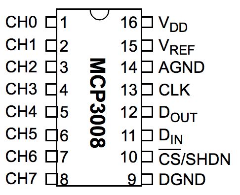
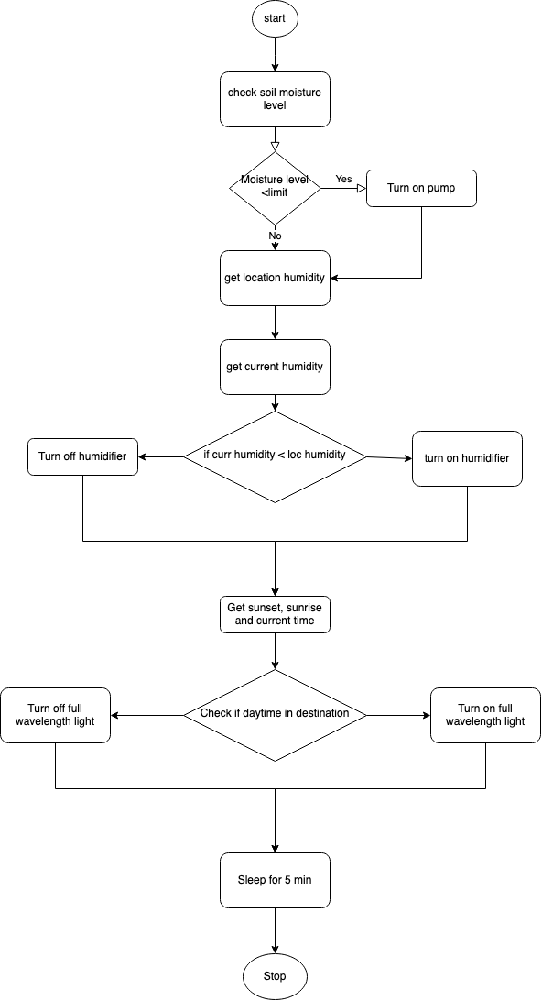

  ```
  Anusha Hegde
  anuhegde@uw.edu
  ```

# Recreating native weather for indoor plants


## Objective 

The objective of the assignment 3 is to take the knowledge gained from assignment 1 & 2 and apply that knowledge to specific problem. My objective is to create a native weather for the indoor plants. Goal is to create the weather pattern of any city in the world by making webAPI call with the city ID. Most of the indoor plants are from tropical region, so providing their native weather stimulates the healthy growth. As someone from who grew up in the tropical city I want to recreate the weather pattern of my hometown for my houseplants.

## Motivation

After almost killing some my favorite plants when I was away from home for few weeks, I looked up few automatic water gardening system online. But I could not find any system that creates the whole weather pattern in the market. Instead of just automatic watering I decided give houseplants their native weather pattern by building this project.

## Requirements
1. Raspberry pi 4b
2. Bread board
3. MCP3008 analog to digital converter
4. Moisture sensor 
5. DHT22 temperature and humditiy sensor
6. DC pump
7. Relay
8. Vinly tubes for watering
9. Smart plug
10. Humidifier
11. Grow light
12. Male to female, female to male, male to male jumper wires


## Characterization

### DHT22 sensor
The DHT22 is the temperature and humidity sensor. Few details about DHT22 are 
1. Low cost <br/>
2. 3V to 5V power and I/O <br/>
3. 2.5mA max current use during conversion (while requesting data) <br/>
4. Good for 0-100% humidity readings with 2-5% accuracy <br/>
5. Good for -40 to 80°C temperature readings ±0.5°C accuracy <br/>
6. No more than 0.5 Hz sampling rate (once every 2 seconds) <br/>
7. Body size 15.1mm x 25mm x 7.7mm <br/>
8. 3 pins with 0.1" spacing <br/>

Reasons why I chose DHT22 over DHT11
1. Ultra-small size
2. Extremely low power consumption, and with a signal transmission distance of more than 20 meters thus it’s able to withstand the most demanding applications.
3. Humidity sensor of 0 to 99.9 %RH with ±2% accuracy while the temperature sensor ranges from -40 to 80℃ with ±0.5℃ accuracy.
Since DHT22 has more accuracy rate with humidity I chose this over DHT11 sensor. Too high or low humidity can effect the sensitive plants. The DHT22 is a 3 pin sensor with VCC,GND and Data pin. I have used board library to get the data from DHT22 sensor. For that I had to install adafruit_dht python library. <br/> 


### WebAPI 
To get the weather details of the city anywhere in the world I made the webAPI call to ```api.openweathermap.org/data/2.5/weather?id={city id}&appid={API key}``` <br/> 
webAPI call can be made using longitude latitude or city ID/location. For me using city ID was the best option. <br/> 
openweathermap.org can make 1,000,000 calls/month, 60 calls/minute it worked for my requirement since I was not making more calls than the limit. Below is the description of the call made before. 


Below data is the example JSON file result of the webAPI call. The data required for my project are temp,humidity,sunrise,sunset, dt for current time in the destination city for grow lights. In future I need main for cloud description to change the brigtness of the grow light.

```
{
     "coord": {
       "lon": 145.77,
       "lat": -16.92
     },
     "weather": [
       {
         "id": 802,
         "main": "Clouds",
         "description": "scattered clouds",
         "icon": "03n"
       }
     ],
     "base": "stations",
     "main": {
       "temp": 300.15,
       "pressure": 1007,
       "humidity": 74,
       "temp_min": 300.15,
       "temp_max": 300.15
     },
     "visibility": 10000,
     "wind": {
       "speed": 3.6,
       "deg": 160
     },
     "clouds": {
       "all": 40
     },
     "dt": 1485790200,
     "sys": {
       "type": 1,
       "id": 8166,
       "message": 0.2064,
       "country": "AU",
       "sunrise": 1485720272,
       "sunset": 1485766550
     },
     "id": 2172797,
     "name": "Cairns",
     "cod": 200
     }
```
 <br/> 

### Moisture sensor 

The moisture sensor used is KY70. It has both analog and digital output. I was looking for a moisture sensor which has analog output and the one which can be adjusted according to the plant needs. Few plants does not need too much water and stays healthy in dry soil(like cactus family) and few of the plants needs constant moist soil(like ferns). So accuracy of the moisture sensor was high priority for me. This particular sensor offered everything I was looking for. For reading the analog output I have used MCP3008 analog to digital converter. The pin configuration of the MCP3008 is shown below.
  <br/>


MCP3008 Pin 16(VDD) to Raspberry pi Pin 1(3.3V) <br/>
MCP3008 Pin 15(VREF) to Raspberry pi Pin 1(3.3V) <br/>
MCP3008 Pin 14(AGND) to Raspberry pi Pin 6(GND) <br/>
MCP3008 Pin 13(CLK) to Raspberry pi Pin 23(SCLK) <br/>
MCP3008 Pin 12(DOUT) to Raspberry pi Pin 21(MISO) <br/>
MCP3008 Pin 11(DIN) to Raspberry pi Pin 19(MOSI) <br/>
MCP3008 Pin 10(CS/SHDN) to Raspberry pi Pin 24(CE0) <br/>
MCP3008 Pin 9(DGND) to Raspberry pi Pin 6(GND) <br/>
SoilMoisture GND to GND <br/>
SoilMoisture VCC to +3.3V (connected to bread board) <br/>
SoilMoisture A0 to MCP3008 CH0 <br/>

Since it is a 8 channel model, 8 moisture sensors can be accomodated in this particular design. <br/> 


### Pump
The pump used to water the plant is mini water pump generally used for aquariums. It works in DC voltage ranging from 3-5V,it has brushless dc design and can work continously for 300 hours which is one aspect I was looking for, I chose this pump.The pump wake time and sleep time had to be adjusted to drop few drops at a time. The library used to work the pump is board. Pump is connected via relay in order to accomate 4 more pumps for 4 different plants. The data pin from relay is connected to GPIO pin number 23.


## Circuit diagram 


  <br/>

## Flow chart

 <br/>

The flow of the project starts with 
1. Reading the soil moisture level from moisture sensor(1023 being driest and 200 being moist/damp soil) if soil moisture level is greater than 400(depending on the type of plant) then turn on the pump for 0.05 seconds and turn off to avoid overwatering. 
2. Get current humidity and temperature using DHT22 sensor. Get location humidity using webAPI. If the humidity in the room is less than location humidity turn on the humidifier or else turn off humidifer. 
3. In the same JSON file sunrise, sunset and current time is given. Using that if it is day then turn on the grow light or turn off the grow light. 
4. Sleep for 5mins and start again

## Hurdles along the way

Few of the problems that might occur in the future is 

1. When I connected the pump and moisture sensor to the same bread board either one of those were working, but when moisture sensor and DHT22 sensor were connected it was working fine. I had to use different bread board with 5V from raspberry pi for the pump. Even though all these three were having same working voltage range, it was strange that pump and moisture sensor combination did not work. 
2. I did python coding for all different tasks separately and combined them all togther board and GPIO library was conflicting. I had to change all library functions to board inorder to work.
3. Rusting of moisture sensor over time. Few of the customers who have used the same moisture sensor have complaint that in just over a month moisture sensors does not give accurate reading due to rusting. This means I have to replace sensors every month or so. 
4. If away for long time running out of water is also other issue. 
5. If pump or moisture is malfunctioning it can lead to over watering which can create possible pest issues to the plants, or underwatering can kill the plant. Creating a dashboard to monitor these aspects from anywhere is really helpful.


## Conclusion and Future enhancement
Since this is my first time taking embedded course and being new to coding this hands on project helped me a lot in understanding real time embedded systems. Even though at few time it was challenging to troubleshoot the problem it was really fun and I enjoyed working with raspberry pi and sensors. The cost of this project including raspberry pi is around $160.
My future enhancements to the project includes 
1. controlling the temperature using AC/heater. 
2. Reproducing rain patterns by keeping the plants in a separate room and creating greenhouse kind of arrangement with sprinklers. This also helps with cleaning the plant leaves which increases photosyntensis. Changing brightness of the grow light depending on the time of the day.If cloudy then decreasing brightness if sunny full brigtness etc. 
3. Creating dashboard to keep track and control the plant health. 


## Project repository
https://github.com/anushamhegde/Recreating-native-weather-for-indoor-plants

This repo also contains the demo and presentation that was created as part of the project.

## References

1. https://gist.github.com/benrules2/6f490f3a0e082ae6592a630bd7abe588 
2. https://pimylifeup.com/using-ifttt-with-the-raspberry-pi/
3. https://www.instructables.com/Raspberry-Pi-Tutorial-How-to-Use-the-DHT-22/
4. https://gist.github.com/benrules2/6f490f3a0e082ae6592a630bd7abe588
5. https://pimylifeup.com/raspberry-pi-humidity-sensor-dht22/
6. https://community.dfrobot.com/makelog-311806.html 
7. https://www.instructables.com/Measuring-Soil-Moisture-Using-Raspberry-Pi/
8. https://tutorials-raspberrypi.com/measuring-soil-moisture-with-raspberry-pi
9. https://github.com/WayinTop  
10. https://openweathermap.org